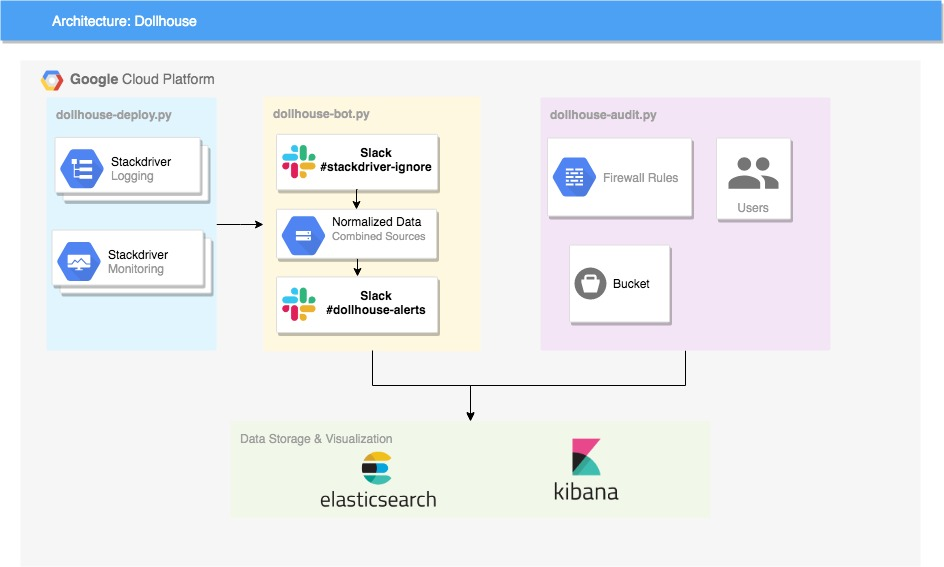

# Dollhouse

Dollhouse is a tool to audit Google Cloud Platform (GCP). As there are many components in GCP, dollhouse aims to be the one tool that can audit the whole platform for you.
It can be used by Security Engineers and DevOps engineers to monitor the whole organization infrastucture. Dollhouse is also able to send alerts based on pre-configured events.

### High Level Architecture


 
### Currently supports: 
------------------------------
- [x] Firewall Rules 
- [x] IAM Roles 
- [x] Service Accounts 

### Requirements
------------------------------
- Account with viewer access on Google Cloud
- `pip install requirements-audit.txt`

### Usage
------------------------------
```
usage: dollhouse-audit.py [-h] [--account ACCOUNT] [--es ELASTICSEARCH]
                          [--firewall] [--iam] [--project PROJECT]
                          [--firewall_name FIREWALL_NAME]

GCP Audit Tool

optional arguments:
  -h, --help                            show this help message and exit
  --account ACCOUNT                     account to run this tool with -> ex: youremail@gmail.com
  --es ELASTICSEARCH                    formats to json and pushes to elastic search
  --firewall                            run firewall rules check
  --iam                                 run IAM Users & Service Accounts check
  --project PROJECT                     query specific project
  --firewall_name FIREWALL_NAME         query specific firewall name
```

To run the audit, you can choose what you want to check (Firewall, IAM) by adding the required arguments
This script can be run on your local machine with your own user. It will fetch the projects that your account has access to. Ideally you should create an account/serviceaccount which has organisation level viewer access so that it becomes easier to run on all the projects.
```
python dollhouse-audit.py --account youremail@email.com --firewall --iam
```
You can also query specific firewall name on a specific project
```
python dollhouse-audit.py --account youremail@email.com --project myProject --firewall_name myfirewallName
```

### ElasticSearch Support
Results can be pushed to ElasticSearch for data storing
```
python dollhouse-audit.py --account myName@email.com --firewall --iam --ES 127.0.0.1
```
------------------------------


# Dollhouse-bot

Dollhouse-bot is a slack bot which gives instant alerts on slack to custom events that you have set. This bot leverages Google Stackdriver Logging & Monitoring to check for events in a GCP Project. 


Screenshot: 


### Requirements
------------------------------
- `pip install requirements-bot.txt`
- Gcloud account with the following permissions: 
    * Logs Configuration Writer
    * Monitoring Editor
    * Service Usage Consumer

# Setup
------------------------------

###### SlackBot 
You can refer to the following [page](https://www.fullstackpython.com/blog/build-first-slack-bot-python.html "Build your first slack bot python") to get you started with building your slack bot application.

###### Config file 
On utils/config.property, input the values for the following variables:
- elasticsearch_host
- elasticsearch_port
- dollhouse_bot_token (Bot User OAuth Access Token)
- EXAMPLE_COMMAND, IAM_ROLE_DESCRIBE_COMMAND, SERVICEACCONT_IDENTIFY_COMMAND, HELP_COMMAND (change it with the ID of your bot)
- running_account
- SLACK_CHANNEL (channel ID which dollhouse-bot will send alerts to)

###### Creating Stackdriver Account
Each project will have their account. This has to be done from the console or you can enable it while using terraform.
Enable Stackdriver API by clicking the hamburger button on the top left, and go to stackdriver monitoring, follow the steps there.
You can organize your stackdriver accounts by adding all projects into one stackdriver workspace, so that logs from all the projects goes into one workspace. 

###### Enabling stackdriver API *(This needs to be done by the project owner)*

The below service apis need to be enabled 
```
logging.googleapis.com                  Stackdriver Logging API
monitoring.googleapis.com               Stackdriver Monitoring API
stackdriver.googleapis.com              Stackdriver API
stackdriverprovisioning.googleapis.com  Stackdriver Provisioning Service
``` 
enable it running the following command
```
gcloud services enable [service_name]
```

##### Automated Deployment

You can deploy this automatically using dollhouse-deploy script.
First, you must write custom logging metrics to that project.
```
python dollhouse-deploy.py -p projectName -d ./ --logserviceAccount --logfirewall --logiam
```

At this point, your project should have filtered out custom logs.

Note: Stackdriver and GCP needs to sync for a minute or two.

Once stackdriver monitoring has been set up, we can deploy stackdriver policies and create a slack notification
Make sure you have a slack token and a slack channel. Example can be seen at `slack_notification.json` file. The alerts sent from stackdriver will not be look at by us because it does not give enough information. Only the bot looks at the alerts from here. You can name your channel to `stackdriver-ignore`. Invite dollhouse-bot to that channel. It will listen and parse the alerts and send it to the actual channel you specified on `utils/config.property`.

To deploy policies and slack channel:
```
python dollhouse-bot.py --createslack --stackdriverfirewall --stackdriverserviceAccount --stackdriveriam
```

##### Running Dollhouse-bot
To run dollhouse-bot, you can simply do
`python dollhouse-bot.py`

### Authors
------------------------------

* **Fahri Shihab**
* **Sanjog Panda**

### Credits
------------------------------
* **GO-JEK Security Team**

### Future Plans for Dollhouse:
------------------------------

- [ ] We continuously trying to improve on the code quality of the tool to make it more modular and maintainable.
- [ ] Adding support on *GCS bucket* 
- [ ] Whitelisting/Blacklisting alert rules from slack
