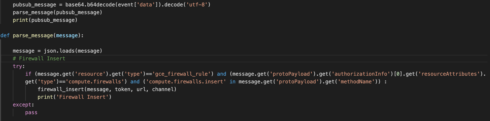

## Dollhouse
We like to view our organization as a dollhouse. It has many dolls which correspond to the empolyees. It also has many windows corresponding to the visibility from the outside world. So we created dollhouse to be able to alert us if any window in our organization is being opened for the outside world to see.

## Code style
[](https://github.com/feross/standard)
 
## Screenshots
Here are the sample alerts dollhouse gives. They are color coded so you can identify what kind of alert they are in a glance.

**Firewall**


**Identity Access Management**


**Service Account**


## Software Architecture


## Features
Dollhouse gives you the ability to be alerted first-hand when an incident happens. We have created a few incident templates and color code them on the alert for easier visualization. These alerts include:

|Firewall|IAM|Service Account|GCE Instance|Kubernetes|Cloud Storage|  
|-|-|-|-|-|-|
| Insert |All Changes | Create Key| Set Tags| Anonymous Access|Public Bucket/Object |
| Patch | |Delete Key | Add Access Config| Public Cluster| | 
| Delete | | | | | |

These alerts can be customized at [deploy_sink.py](/cloudfunction/deployments/deploy_sink.py)

## Code Example
Since we are using google cloud function, we need to parse the message received and check the message with several conditions to validate what kind of alert they are. If an alert type is found, we forward it to the respective function which will handle the message.



## Installation
At this moment, **we only support Google Cloud Platform.**

- #### Create Project Topic
    1. On your chosen project in which you have owner access to, create a Pub/Sub Topic and name it `dollhouse-topic`
    2. Create a service account named `security-dollhouse` which will have an email `security-dollhouse@<YOUR_PROJECT>.iam.gserviceaccount.com`
    3. Give the following permissions to the service account:
        - [Organization] View
        - [Organization] Log Configuration Writer
 
Now for this part, it is essential to have organization access or you can also ask an organization admin to help you with the following.
- #### Organization Log Sink
    1. Create an organization level log sink which will export your custom metric logs to the created Pub/Sub topic you created in the previous step.
    You can use this command:
    ```
    gcloud logging sinks create dollhouse-allprojects \
        pubsub.googleapis.com/projects/<YOUR_PROJECT>/topics/dollhouse-topic \
        --include-children \
        --organization=<ORGANIZATION_ID> \
        --log-filter="(resource.type=gce_firewall_rule compute.firewalls.insert compute.googleapis.com/resource_name GCE_OPERATION_DONE AND severity!=ERROR) OR (resource.type=project protoPayload.methodName=SetIamPolicy protoPayload.serviceData.policyDelta.bindingDeltas.action:* severity!=ERROR)"
    ```
    After successfully running the command, you will receive a service account as the output. Please remember to grant that service account `Pub/Sub Publisher` role on your chosen project. At this point, all the logs should be sent to your topic.

    _NOTE: That command only exports `Firewall Insert` and `IAM Changes` logs. In step 2 we will tell you how to export all the other logs._

    If at any point you would like to add/remove metrics from the sink, you can leverage a small script we have created to help you with it.
    You can run [deploy_sink.py](/cloudfunction/deployments/deploy_sink.py) with your organization ID and sink name as the argument. Make sure your `gcloud` command is [authenticated using](https://cloud.google.com/docs/authentication/production#command-line) `security-dollhouse@<YOUR_PROJECT>.iam.gserviceaccount.com`. 

- #### Cloud Function Deployment
    Now you have the logs sent to your topic as messages. The next step is to process those messages to send you alerts.
        
    1. Navigate to the [cloudfunction](/cloudfunction/) directory and run the following command with your adjusted parameter values. Don't put your variable value in a quote.
    
    Parameter values to adjust:
    - service-account
    - set-env-vars
    - region


    ```
    gcloud functions deploy dollhouse-cf  \
        --project=<YOUR_PROJECT> \
        --entry-point=receive_request \
        --runtime=python37 \
        --trigger-topic=dollhouse-topic  \
        --service-account=security-dollhouse@<YOUR_PROJECT>.iam.gserviceaccount.com \
        --set-env-vars SLACK_TOKEN=SLACK_TOKEN \
        --region=asia-east2
    ```
- #### Server Deployment
    Referring to the architecture diagram, the server will consist of 3 different components
    - Dashboard
    - Elasticsearch
    - Bot
    
    When creating the server, make sure the default service account is `security-dollhouse@<YOUR_PROJECT>.iam.gserviceaccount.com`
    
    ##### Bot
    The bot is used so you can communicate with dollhouse to ask questions
    ``` 
    @dollhouse describe FIREWALL_NAME in PROJECT_NAME
    @dollhouse what is TAG_NAME in PROJECT_NAME
    @dollhouse identify SERVICE_ACCOUNT in PROJECT_NAME
    ```

    
    
    1. Set up your bot to subscribe to [Slack Events API](https://api.slack.com/events-api). You may need a public IP or you can use tools like ngrok to create a tunnel.
    2. Under Oauth & Permissions, add the following scope to your bot
        - app_mentions:read

        
    *You need to copy the Verification Token under App Credentials and Bot User OAuth Access Token under Oauth & Permissions and store it to the environment variable of your server* 
    *Example*
    ```
    export SLACK_TOKEN=${{SLACK_TOKEN}}
    export VERIFICATION_TOKEN=${{VERIFICATION_TOKEN}}
    ```

    ##### Dashboard
    WIP
    ##### Elasticsearch
    WIP


## Tests 
The simplest way to make sure this works is to create a firewall rule in your project.
You should see the alert on your slack channel within 1-2 seconds 😇

## Whitelisting 
Receiving too many unnecesssary alerts? We got you covered! 😎 Check out this [whitelist file](/cloudfunction/rules/whitelist.yaml). We have the capability to whitelist firewall rules and IAM roles.

## Configuration
Sometimes a lot of the firewall alerts are opening a port to allow access to a private IP. If you wish not to receive such alerts, you can add that configuration here at the [configuration file](/cloudfunction/rules/config.yaml), just add a tag of `PUBLIC_IP_ONLY` 😎

## Contribute
[Please do!] We are looking for any kind of contribution to improve dollhouse's core funtionality and documentation. When in doubt, make a PR!

## Credits
- Gojek Product Security Team ❤️

## License
```
Copyright 2020, Gojek (https://www.gojek.io/)

Licensed under the Apache License, Version 2.0 (the "License");
you may not use this file except in compliance with the License.
You may obtain a copy of the License at

    http://www.apache.org/licenses/LICENSE-2.0

Unless required by applicable law or agreed to in writing, software
distributed under the License is distributed on an "AS IS" BASIS,
WITHOUT WARRANTIES OR CONDITIONS OF ANY KIND, either express or implied.
See the License for the specific language governing permissions and
limitations under the License.
```
